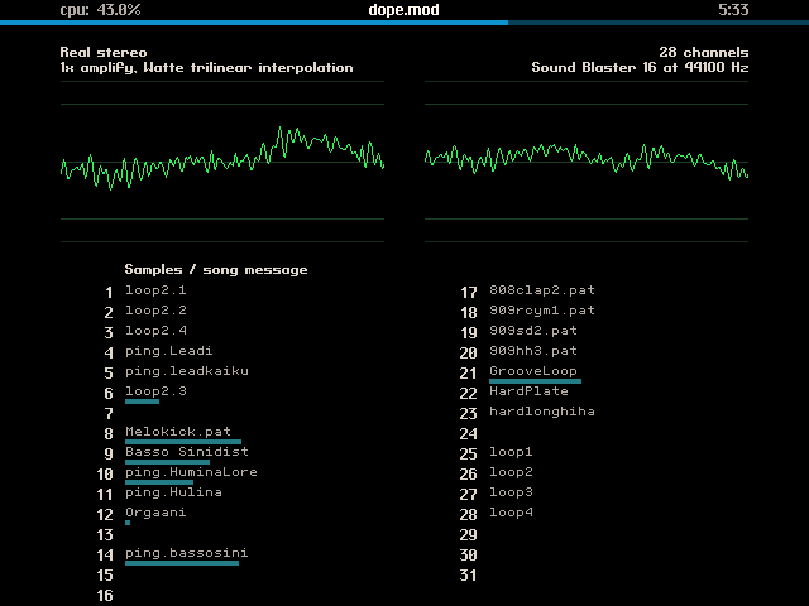

This is

Therapy MOD player (tmodplay)
=============================

_a 32-bit protected mode DOS player for MOD music format_

- Multichannel support
- Optimized 16-bit mixers
- Variable amplification with clipping
- Various sample interpolation methods
- Stereo crossfade for hard panned (Amiga) MODs
- Real stereo mode for MODs utilizing panning commands
- 640x480 graphical user interface with scopes and RMS meters

A browser/Javascript based version is available at https://github.com/a11599/tmodplay-js with a few additional features. Try it online at https://a11599.github.io/tmodplay-js/!


# Primer

This is the modern remake of a multichannel [MOD](https://en.wikipedia.org/wiki/MOD_(file_format)) player I wrote back in the mid-90's for retro PC platforms. Why? Because programming for limited hardware with direct control over it is a challenging, but rewarding fun. Also this old modplayer of mine was lost back in the day in a sad hard drive accident and burned a hole in my heart. So it was about time to rebuild it and make it even better than it ever was to heal my wounds finally.



It requires a 386 or above running MS-DOS or Windows 9x/ME, or an emulator such as DOSBox. It is written in full assembly using [PMI, a 32-bit protected mode host](https://github.com/a11599/pmi) and [mod, a MOD player library for PMI](https://github.com/a11599/mod). The MOD player supports ProTracker format and its close derivates up to 32 channels on the following sound cards:

- PC speaker up to 29 kHz sample rate
- LPT DAC variants (single, dual, stereo) up to 44.1 kHz sample rate
- Sound Blaster, Pro and 16 up to 22/44.1 kHz sample rate (depending on actual model)

An extremely optimized software wavetable with 16-bit mixing, optional linear and trilinear Watte interpolation upsampling is included for non-wavetable sound cards (all of them for now, but at least GUS support is planned in the future). Stereo is supported with hard pan or 75% crossfeed. True stereo panning via `8xx` and `E8x` MOD commands is also available.

The main development platform is a modern PC with DOSBox-X, but the result is always tested (also some parts are developed) on the following retro hardware: Abit BX6 2.0 (Intel 440BX chipset), Intel Pentium II 350 MHz, Sound Blaster 16 Vibra16S (CT2800) ISA, Serdaco CVX4 (LPT DAC), PicoGUS v2.0 and nVidia Geforce 440MX 64 MB AGP running Windows 98 SE and MS-DOS 7.0.


# Usage

Type `tmodplay /h` to display help on command line arguments. Press F1 during playback to show the supported keyboard commands. Refer to [tmodplay.txt](tmodplay.txt) for further details.


# Building from source

## Pre-requisites

The app can be built under DOS, Windows and Linux.

To build it:

- Install [NASM](https://nasm.us).
- Install [Open Watcom](https://www.openwatcom.org/) tools. For DOS and Windows you can use the 1.9 "final" release, for Linux you need to install a v2 release from the [GitHub releases page](https://github.com/open-watcom/open-watcom-v2/releases). If the Linux x64 installer does not work, just use the x86 version, but make sure to select the appropriate x64 host target.
- Copy `env.lin` on Linux, `env.win` on Windows or `env.dos` on DOS to `env` and adjust the following parameters:
  - `NASM_BIN`: Path to NASM executable (usually `nasm` on Linux, `nasm.exe` on Windows and DOS). If `nasm` is added to the path, the parameter can be left empty.
  - `WATCOM_BIN_DIR` (Linux and Windows only): Path to directory containing Open Watcom platform-dependent binaries. If the directory is added to the path, the parameter can be left empty.
- (DOS only) The directory containing the Open Watcom platform-dependent binaries MUST be added to the PATH.
- Download [PMI](https://github.com/a11599/pmi), extract it into the same parent as of `mod` and build the PMI distribution by executing `./make.sh dist` or `make.bat dist` in the PMI folder (see PMI documentation for details).
- Download [mod](https://github.com/a11599/mod), and extract it into the same parent as of tmodplay.
- Create the `mod` directory under `tmodplay` and copy some MOD files into this folder for testing. The folder structure should look like this:

```
  |
  +-- pmi
  |   |
  |   +-- build
  |   +-- dist
  |   +-- emu
  |   +-- lib
  |   +-- src
  |       ...
  |
  |
  +-- mod
  |   |
  |   +-- src
  |       ...
  |
  +-- tmodplay
      |
      +-- emu
      +-- src
      +-- mod      <- copy your MOD files here
          ...
```

## Building the application

- Change the current directory to the project folder, then run `./make.sh` on Linux or `make.bat` on Windows and DOS (further referred to as `make`) to create a debug build to `build\debug\tmodplay.exe`.
- Add the `build=release` parameter to create a release build to `build\release\tmodplay.exe`.
- Building `tmodplay` will automatically rebuild `mod` for the same build target (debug or release).
- Further build targets (append after `make` or `make build=release`) are:
  - `clean`: Remove compiled binaries in `build\debug` or `build\release` directory.
  - `full`: Force a full recompilation (compilation by default is incremental, only changed source code is recompiled).
  - `dist`: Create a binary distribution package to `dist` directory.

To test it:

- On Linux and Windows:
  - Install DOSBox. [DOSBox-X](https://dosbox-x.com/) or [DOSBox Staging](https://www.dosbox-staging.org/) is preferred because they are actively developed, but plain old [DOSBox](https://www.dosbox.com/) should also work.
  - Set `DOSBOX_BIN` in `env` to the path of the DOSBox executable. If `dosbox` is added to the path, the parameter can be left empty.
  - If you want to use custom DOSBox options, create `dosbox.conf` and set your configuration overrides.
- - Copy `test_bat.sam` to `test.bat` and adjust `file` and `args` environment variables according to your testing requirements. `file` should point to a MOD file and `args` contains parameters to the player. Run `tmodplay /h` to display the available command line parameters or refer to [tmodplay.txt](tmodplay.txt).
- Run `./make.sh db` on Linux or `make.bat db` on Windows and DOS to create a debug-enabled build and execute it.


To start DOSBox with the same environment as `make`, run `./dosbox.sh` on Linux or `dosbox.bat` on Windows. You can then manually test the build by running `test.bat` or executing `build\debug\tmodplay.exe` with your custom parameters.


# Why 386 and why protected mode?

This project originally targeted the 286 which was very challenging. However it was soon realized that:

- The 286 is not really suitable for 16-bit mixing, and it's just not fast enough for acceptable (32 kHz+) sample rates unless it's a higher clock rate (12 MHz+) model anyways.
- There are large MODs (especially those made on PCs and later expanded Amigas) out there and the 640 KB limit of conventional memory quickly became a bottleneck.
- There are also a few MODs with samples larger, than 64 KB and supporting this with segment:offset arithmetic (especially for loops) was annoying and slow.

I wanted this player to have better sound quality and more compatibility than contemporary players with similar CPU usage and my goals just didn't seem to work out with the 286. And if the 286 is not good enough, why bottleneck 386 and later with 16-bit instructions?

Why protected mode? For some time, tmodplay used [flat real mode](https://en.wikipedia.org/wiki/Unreal_mode) and it was working fine, but I eventually ran into several issues:

- The audio mixer code, which uses most of the CPU had a lot of 32-bit registers and addressing, thus generating operand and/or address size prefixes for almost every instruction. This consumed a significant amount of CPU cycles: after converting to protected mode, CPU usage was almost halved with Watte interpolation on a Pentium CPU.
- It was not compatible with EMM386. Although it could be made to work with it, it would have lost the simplicity and appeal of flat real mode.
- It would have never worked under Windows. While it was not a big concern and it was never a goal of this project, being compatible with Windows 9x DOS box is a nice thing to have.